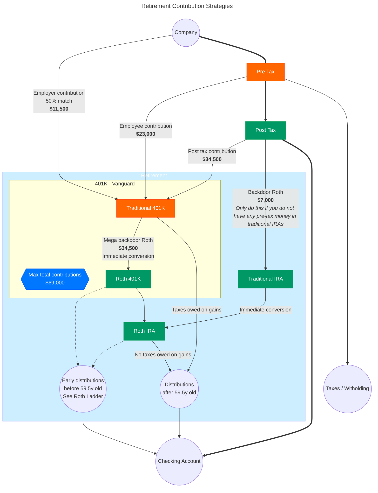

# finance
Flow chart of retirement contribution strategies in US.
Please check with a professional regarding your tax liabilities before proceeding. This should not be treated as financial advice and I am not responsible for how you use this information.

Note that the values in the graph are based on 2024 values and these will likely change for 2025:

## 401K contributions = max $69,000 total [Sourced from IRS](https://www.irs.gov/retirement-plans/plan-participant-employee/retirement-topics-401k-and-profit-sharing-plan-contribution-limits)
   - Max $23,000 employee contribution
   - Example employer match, let's just say 50%, up to $11,500 maximum
   - This leaves $34,500 for post-tax 401K contributions ($69,000 total - $23,000 employee - $11,500 employer)

## Roth IRA contributions = max $7,000 total [Sourced from IRS](https://www.irs.gov/retirement-plans/plan-participant-employee/retirement-topics-ira-contribution-limits#:~:text=Note%3A%20For%20other%20retirement%20plans,taxable%20compensation%20for%20the%20year)
   - Single filing

| Filing Status   | AGI Range                    | Contribution Status                              |
|-----------------|------------------------------|--------------------------------------------------|
| Single          | < $146,000                   | Direct contributions allowed up to limit         |
| Single          | >= $146,000 and < $161,000   | Reduced amount                                   |
| Single          | >= $161,000                  | No direct contributions, so do the backdoor Roth |
   - Joint filing

| Filing Status   | AGI Range                    | Contribution Status                              |
|-----------------|------------------------------|--------------------------------------------------|
| Joint           | < $228,000                   | Direct contributions allowed up to limit         |
| Joint           | >= $228,000 and < $240,000   | Reduced amount                                   |
| Joint           | >= $240,000                  | No direct contributions, so do the backdoor Roth |

## Roth Ladder
Typically, you can withdraw your contributions from Roth plans early without penalty (as long as you don't touch any gains).

However, for each Roth conversion performed (backdoor or mega backdoor), you must wait 5 years from the conversion date before you can do this. As a result, this is commonly termed as the "roth ladder" since it is 5 years from each conversion.

[More information via Investopedia](https://www.investopedia.com/how-roth-conversion-ladder-works-5214808)

## Flow Chart

