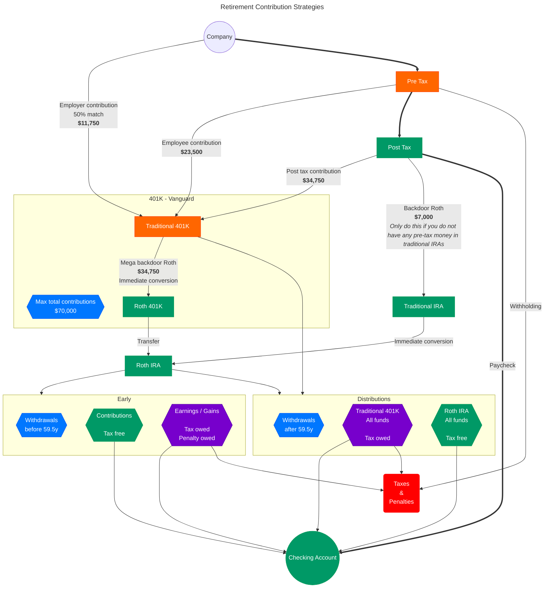

# finance
Flow chart of retirement contribution strategies in US.
Please check with a professional regarding your tax liabilities before proceeding. This should not be treated as financial advice and I am not responsible for how you use this information.

Note that the values in the graph are based on values for 2025:

## 401K contributions = max $70,000 total [Sourced from IRS](https://www.irs.gov/newsroom/401k-limit-increases-to-23500-for-2025-ira-limit-remains-7000)
   - Max $23,500 employee contribution
   - Example employer match, let's just say 50%, up to $11,750 maximum
   - This leaves $34,750 for post-tax 401K contributions ($70,000 total - $23,500 employee - $11,750 employer)

## Roth IRA contributions = max $7,000 total [Sourced from IRS](https://www.irs.gov/newsroom/401k-limit-increases-to-23500-for-2025-ira-limit-remains-7000)

   
Single filing

   
| Filing Status   | AGI Range                    | Contribution Status                              |
|-----------------|------------------------------|--------------------------------------------------|
| Single          | < $150,000                   | Direct contributions allowed up to limit         |
| Single          | >= $150,000 and < $165,000   | Reduced amount                                   |
| Single          | >= $165,000                  | No direct contributions, so do the backdoor Roth |

   
Joint filing

   
| Filing Status   | AGI Range                    | Contribution Status                              |
|-----------------|------------------------------|--------------------------------------------------|
| Joint           | < $236,000                   | Direct contributions allowed up to limit         |
| Joint           | >= $236,000 and < $246,000   | Reduced amount                                   |
| Joint           | >= $246,000                  | No direct contributions, so do the backdoor Roth |

## Roth Ladder
Typically, you can withdraw your contributions from Roth plans early without penalty (as long as you don't touch earnings).

However, for each Roth conversion performed (backdoor or mega backdoor), you must wait 5 years from the conversion date before you can do this. As a result, this is commonly termed as the "roth ladder" since it is 5 years from each conversion.

[More information via Investopedia](https://www.investopedia.com/how-roth-conversion-ladder-works-5214808)

## Flow Chart

```mermaid
---
title: Retirement Contribution Strategies
---
flowchart TD

%% Definitions
Company((Company))

pretax[Pre Tax]:::orange
posttax[Post Tax]:::green
checking((Checking Account)):::green
taxes(Taxes<br/>&<br/>Penalties<br/>):::red
ira-trad[Traditional IRA]:::green
ira-roth[Roth IRA]:::green

subgraph 401K - Vanguard
  401k-info{{Max total contributions<br/>$70,000}}:::blue
  401k-trad[Traditional 401K]:::orange
  401k-roth[Roth 401K]:::green
end

%% Arrows / Flows
Company --Employer contribution<br/>50% match<br/><b>$11,750</b>--> 401k-trad
Company ==> pretax
pretax --Employee contribution<br/><b>$23,500</b>--> 401k-trad
pretax ==> posttax

posttax --Post tax contribution<br/><b>$34,750</b><br/>--> 401k-trad
401k-trad --Mega backdoor Roth<br/><b>$34,750</b><br/>Immediate conversion-->401k-roth

401k-roth --Transfer--> ira-roth
posttax --Backdoor Roth<br/><b>$7,000</b><br/><i>Only do this if you do not have any pre-tax money in traditional IRAs</i>--> ira-trad 
ira-trad --Immediate conversion--> ira-roth

subgraph Early
   age-early{{Withdrawals<br/>before 59.5y}}:::blue
   withdraw-early-contributions{{Contributions<br/><br/>Tax free}}:::green
   withdraw-early-earnings{{Earnings / Gains<br/><br/>Tax owed<br/>Penalty owed}}:::purple
end

subgraph Distributions
   age-retired{{Withdrawals<br/>after 59.5y}}:::blue
   withdraw-401k{{Traditional 401K<br/>All funds<br/><br/>Tax owed}}:::purple
   withdraw-roth{{Roth IRA<br/>All funds<br/><br/>Tax free}}:::green
end

ira-roth --> Early
withdraw-early-contributions ---> checking
withdraw-early-earnings --> checking & taxes

401k-trad --> Distributions
withdraw-401k --> checking
withdraw-401k --> taxes
ira-roth --> Distributions
withdraw-roth --> checking

posttax ==Paycheck==> checking
pretax --Withholding--> taxes

%% Styling

classDef purple fill:#7700cc,stroke:#5500aa,color:#ffffff
classDef red fill:#ff0000,stroke:#ff0000,color:#ffffff
classDef orange fill:#ff6600,stroke:#ff3300,color:#ffffff
classDef green fill:#009966,stroke:#009955,color:#ffffff
classDef blue fill:#0077ff,stroke:#0055ff,color:#ffffff
```
